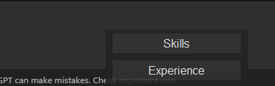

# PromptClipboard

PromptClipboard is a lightweight, standalone application that lets users quickly copy and paste predefined prompts for common tasks. The app features a minimalistic, transparent UI that appears near the mouse cursor and automatically pastes selected text.

## Features

- **Predefined Prompts**: Quickly copy common text snippets like `Skills`, `Experience`, and `Projects`.
- **Compact and Transparent UI**: Designed for ease of use with a dark mode interface.
- **Automation**: Automatically pastes the selected text and closes after completion (for certain prompts).
- **Standalone Executable**: No Python installation required.

## Screenshots



## Installation

1. **Download the Executable**:
   - Download the latest `promptclipboard.exe` from the [Releases](https://github.com/aniketatgithub/PromptClipboard/releases) page.

2. **Run the Application**:
   - Double-click `promptclipboard.exe` to start the app.

## Usage

1. **Select a Prompt**:
   - Choose `Skills`, `Experience`, or `Projects` from the app's interface.
2. **Focus on Target Field**:
   - Move to a text input field in another application (e.g., Notepad, Word, or Browser).
3. **Automatic Paste**:
   - The app pastes the selected prompt automatically.

## Development

### Prerequisites

- Python 3.9 or above
- Required dependencies:
  ```bash
  pip install pyinstaller pyautogui pyperclip
